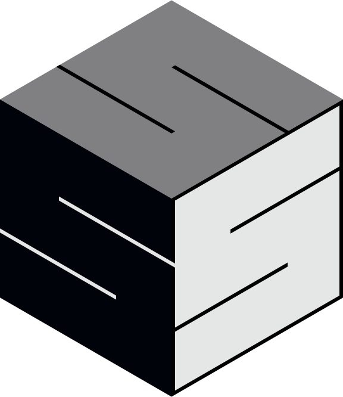

# Welcome to the TNO Software and System Security Research Group!

<picture>
  
</picture>

Welcome to the official GitHub organisation of the **Software and System
Security Expertise** (S³, pronounced 'S-cubed') at [TNO](https://tno.nl/) (The
Netherlands Organisation for applied scientific research). Our team is dedicated
to pioneering research and development in the field of software and system
security. We focus on creating supportive technology for realising robust,
secure, and resilient software solutions that meet the challenges of the modern
digital landscape.

## About Us

In an increasingly interconnected world, the security of software and systems is
more critical than ever. Our research group at TNO brings together experts in
cybersecurity, software engineering, and software testing to tackle complex
security challenges faced by governments, businesses, and society at large. We
strive to provide innovative solutions through applied research by bridging the
gap between academic / fundamental research and industrial application of
promising / upcoming technology.

We innovate upcoming technology to be

- accessible,
- applicable,
- actionable, and
- explainable.

### Our Research Focus

<picture>
  <source media="(prefers-color-scheme: dark)" srcset="assets/research-focus-dark.svg">
  <source media="(prefers-color-scheme: light)" srcset="assets/research-focus.svg">
  
</picture>

Our research is centered around three key areas of software and system security,
with a strong emphasis on developing supportive tools and technologies. While
each area has its unique focus, there is considerable overlap in the methods and
technologies we utilise, underscoring the integrated nature of our work.

### 1. Software Security Testing

Our work in **software security testing** focuses on dynamic testing techniques
to ensure that software systems are robust and secure. Key areas include:

- **Fuzzing**: Enhancing fuzzing techniques to generate unexpected inputs that
  stress-test software and reveal hidden vulnerabilities.
- **Stateful Testing**: Using stateful testing techniques to consider the
  internal states of applications, which helps in detecting more complex
  vulnerabilities that could be exploited.
- **Search-Based Software Testing (SBST)**: Developing tools that use search
  algorithms to automatically generate test cases designed to uncover security
  vulnerabilities in software.
- **Model-Based Testing**: Creating abstract models of software to automatically
  generate a comprehensive set of test cases, helping to identify potential
  security issues across various scenarios.

### 2. Secure Products

Our research in **secure products** focuses on enhancing the security of
software products throughout their lifecycle, from development to deployment,
with a particular emphasis on supply chain security. Key areas include:

- **Software Bill of Materials (SBOMs)**: Developing tools for generating and
  managing SBOMs to provide transparency and accountability for all software
  components used in a product.
- **Software Composition Analysis (SCA)**: Creating tools that help identify
  third-party components within software products. For instance tools to
  identify statically compiled components in binaries.
- **Supply Chain Cybersecurity**: Developing technologies and methodologies to
  secure the software supply chain, ensuring that all components are delivered
  securely and are free from tampering.
- **Secure by Design**: Continuing to advance secure-by-design principles that
  incorporate security from the start of the product development process.

### 3. Vulnerability Research

Our **vulnerability research** focuses on discovering and mitigating software
vulnerabilities through both identification and remediation efforts. Key areas
include:

- **(Automated) Vulnerability Discovery**: Leveraging advanced fuzzing
  techniques supplemented by related vulnerability discovery techniques to
  discover even the most elusive software vulnerabilities.
- **(Automated) Exploitation**: Exploring automated exploitation techniques to
  understand how vulnerabilities can be exploited, which in turn informs the
  development of more effective defences.
- **CEMA (Cyber Electromagnetic Activities)**: Researching and developing
  methods for cyber threats that exploit electromagnetic spectrum
  vulnerabilities.
- **(Automated) Patching**: Creating automated patching solutions that help
  quickly and efficiently address vulnerabilities as they are discovered.

## Our Projects

Here on our GitHub organisation, you will find a collection of our open-source
projects, tools, and frameworks that reflect our ongoing research efforts. These
projects are designed to be collaborative, and we welcome contributions from the
community. Some of our featured projects include:

- **[WuppieFuzz](https://github.com/TNO-S3/WuppieFuzz)**: A coverage-guided REST
  API fuzzer written in Rust with
  [LibAFL](https://github.com/AFLplusplus/LibAFL).
- **[piiip - piiip interactively installs intended packages](https://github.com/TNO-S3/piiip)**:
  A wrapper around pip that helps to avoid installation of a different package
  than was intended.

## Get Involved

We believe in the power of collaboration and open innovation. If you are
passionate about cybersecurity and want to contribute to cutting-edge research,
we invite you to get involved. Here’s how you can participate:

- **Contribute to Our Projects**: Check out our repositories and contribute by
  reporting issues, submitting pull requests, or adding new features.
- **Join Our Community**: Engage with our team and other contributors through
  discussions, events, and community forums.
- **Reach Out**:
  [Contact us](https://www.tno.nl/en/about-tno/our-people/thomas-rooijakkers/)
  if you are interested in joint-research and/or have specific questions that
  needs to be resolved.

## Contact Us

If you have any questions, suggestions, or are interested in collaborating with
us, please feel free to reach out. You can contact us through our GitHub page,
the
[TNO website](https://www.tno.nl/en/about-tno/our-people/thomas-rooijakkers/) or
visit [our website](https://tno.nl/) for more information.

**Together, let's build a safer digital future!**

---

Thank you for visiting our GitHub organisation. We hope you find our work
inspiring and look forward to your contributions!

---
